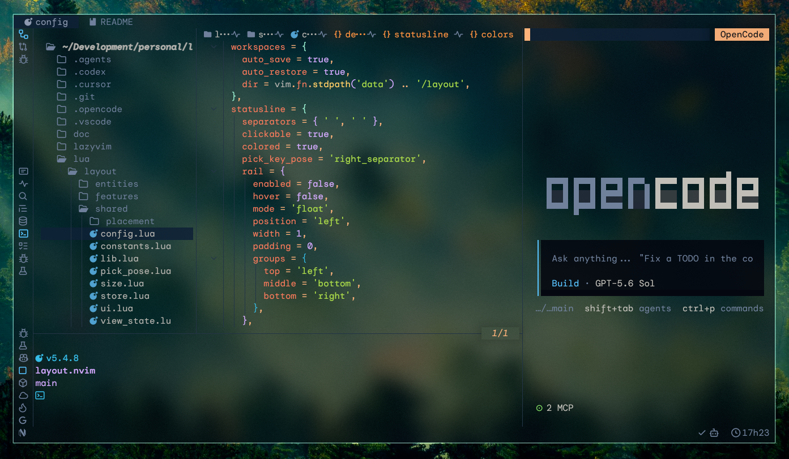

<h1 align="center">
  layout.nvim
</h1>

<p align="center">
  <strong>IDE style panel management for Neovim</strong>
</p>

<p align="center">
  
  
  
  
</p>



<p align="center">
  An opinionated panel manager for Neovim that brings standard IDE style window
  arrangements with reserved left, right, and bottom panels, and declarative view configuration.
</p>

> [!IMPORTANT]
> This plugin is vibe coded with GPT-5.6 Sol.

## Installation

With [lazy.nvim](https://github.com/folke/lazy.nvim):

```lua
{
  'lucobellic/layout.nvim',
  opts = {},
}
```

## Setup

Groups and views are arrays because declaration order controls panel stacking,
statusline order, and picker order. A string filter matches `filetype`; a
function filter receives `(bufnr, winid)`.

```lua
require('layout').setup({
  left = {
    size = 30, -- cells, or a fraction such as 0.25
    groups = {
      {
        name = 'explorer',
        picker = { icon = 'E', key = 'e' },
        views = {
          {
            name = 'filesystem',
            filter = 'neo-tree',
            open = 'Neotree action=show source=filesystem position=left',
          },
        },
      },
    },
  },
  right = { size = 40, groups = {} },
  bottom = {
    size = 15,
    align = 'full',
    groups = {},
  },
  events = { 'FileType', 'WinEnter', 'BufWinEnter' },
  tabpage_scoped_sizes = true, -- remember panel and view sizes independently per tabpage
  live_resize_debounce = 250,
  workspaces = {
    auto_save = true,
    auto_restore = true,
    dir = vim.fn.stdpath('data') .. '/layout',
  },
})
```

Each view may also define `size`, `bo`, and `wo`. View `size` controls its
stacking dimension within the panel. `bo` and `wo` apply buffer-local and
window-local options after placement.

### Bottom Alignment

`bottom.align` controls which columns the bottom panel spans. It defaults to
`full` and accepts four values (`L`, `C`, `R`, and `B` represent the left,
center, right, and bottom regions):

```text
contained                full
┌───┬───────┬───┐        ┌───┬───────┬───┐
│ L │   C   │ R │        │ L │   C   │ R │
│   ├───────┤   │        ├───┴───────┴───┤
│   │   B   │   │        │       B       │
└───┴───────┴───┘        └───────────────┘

left_aligned             right_aligned
┌─────┬─────┬───┐        ┌───┬─────┬─────┐
│  L  │  C  │ R │        │ L │  C  │  R  │
├─────┴─────┤   │        │   ├─────┴─────┤
│     B     │   │        │   │     B     │
└───────────┴───┘        └───┴───────────┘
```

- `contained`: bottom spans the center, left and right keep full height.
- `left_aligned`: bottom spans left and center, right keeps full height.
- `right_aligned`: bottom spans center and right, left keeps full height.
- `full`: bottom spans the entire layout width.

## Commands

- `:Layout toggle [side] <group>` opens or closes a group. The side is required when names are ambiguous.
- `:Layout close <left|right|bottom>` closes every group on a panel.
- `:Layout pick` prompts for a configured picker key.
- `:Layout save` writes the current workspace snapshot.
- `:Layout restore` replaces configured panel views with the saved snapshot.
- `:Layout forget` deletes the current workspace snapshot.

Public Lua helpers include `require('layout').pick([refresh])`,
`get_statusline(side)`, `toggle_rail()`, and
`set_buffer_enabled(bufnr, enabled)`. The last helper temporarily excludes an
already managed buffer from placement.

## Statusline

`get_statusline(side)` returns one statusline-formatted string per configured
group icon. Entries support active/inactive highlights, click regions, and
picker-key rendering.

## Rail

The optional icon rail shows every configured group in a fixed-width window.
It can either float over the editor or reserve a normal buffer window:

```lua
require('layout').setup({
  statusline = {
    colors = {
      hover = 'PmenuSel', -- highlight linked by hovered rail icons
    },
    pick_key_pose = 'right_separator', -- rail maps separator poses to their side
    rail = {
      enabled = true,
      hover = true, -- opt in to mouse hover highlighting
      mode = 'float', -- "float" (default) or "buffer"
      position = 'left', -- "left" or "right"
      width = 1, -- positive integer number of columns
      padding = 0, -- spaces before each icon, included in width
      groups = {
        top = 'left',
        middle = 'bottom',
        bottom = 'right',
      },
    },
  },
})
```

The rail reuses statusline styling, picker keys, and click handling.
Float mode overlays an editor edge, buffer mode reserves a full-height split there.

Toggle the configured rail globally at runtime:

```lua
require('layout').toggle_rail()
```

Icons wider than the configured rail are clipped by display width.
Groups with an icon but no key remain visible and clickable, but do not
participate in keyboard picking.

Each rail section selects a configured panel side. Unmapped sides are omitted.
When the sections do not fit at their ideal anchors, they are packed in top,
middle, bottom order.

## Persistence

Workspace files are keyed by the current working directory. Automatic saving
runs after managed window changes and before a directory change or exit.
Automatic restoration applies the destination directory's exact saved set of
views; changing to a directory without a snapshot closes views inherited from
the previous workspace.

## Health Check

Run the built-in diagnostics after configuring the plugin:

```vim
:checkhealth layout
```

The report checks the Neovim version, setup and registry state, workspace
storage access, and metadata for managed windows in the current tabpage.

## Acknowledgements

layout.nvim is inspired by [edgy.nvim](https://github.com/folke/edgy.nvim) and
[edgy-group.nvim](https://github.com/lucobellic/edgy-group.nvim).
It combines the roles of both plugins into a single plugin, and unlike
edgy.nvim, layout.nvim preserves Neovim's default window-resizing behavior.
